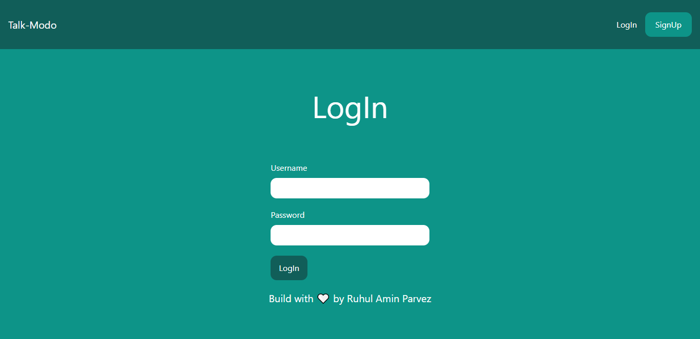
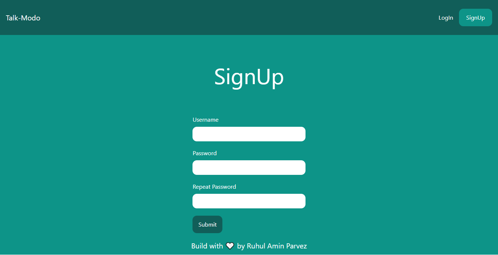
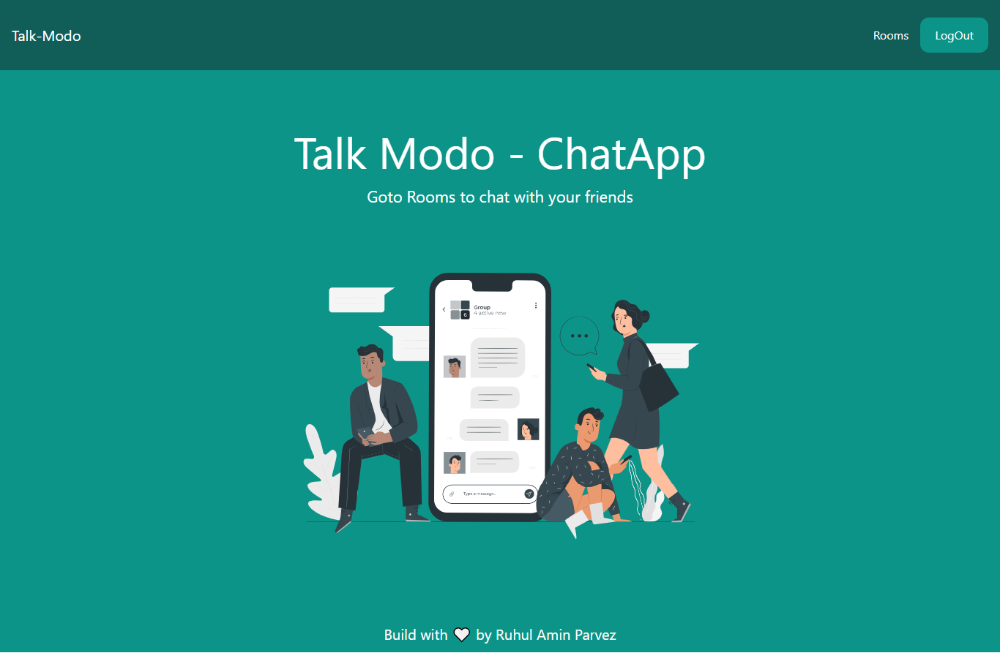
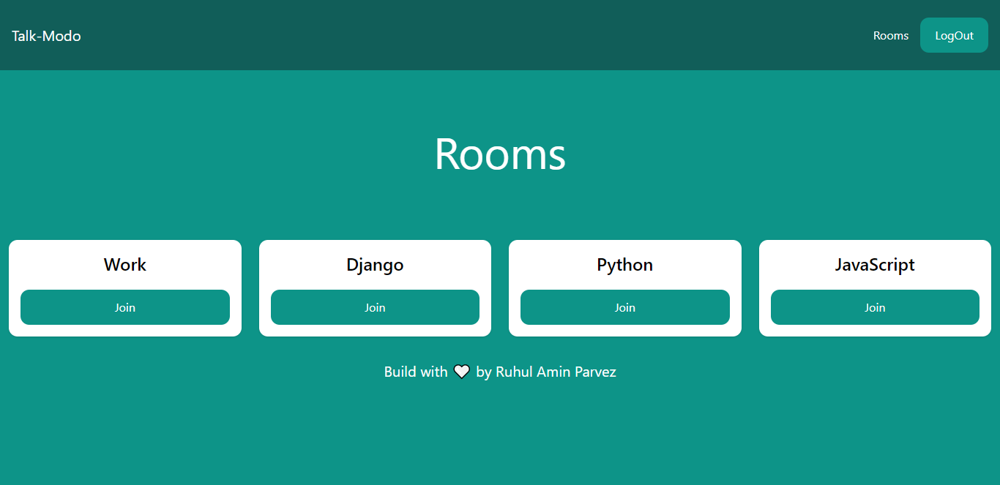
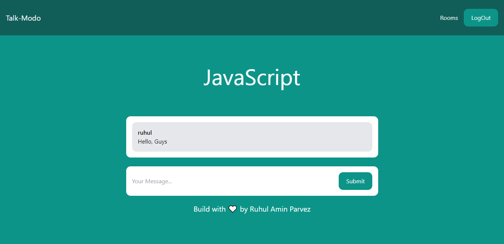

# Talk-Modo
Chatting Web Application Using Django, Socket.io and Tailwind CSS 💬

### Live Preview Link 🔗
- [Talk-Modo Website]() 

### ScreenShots 📸
#### LogIn

  

#### Registration

  

#### HomePage

  

#### Rooms

  

#### Specific Room

  

